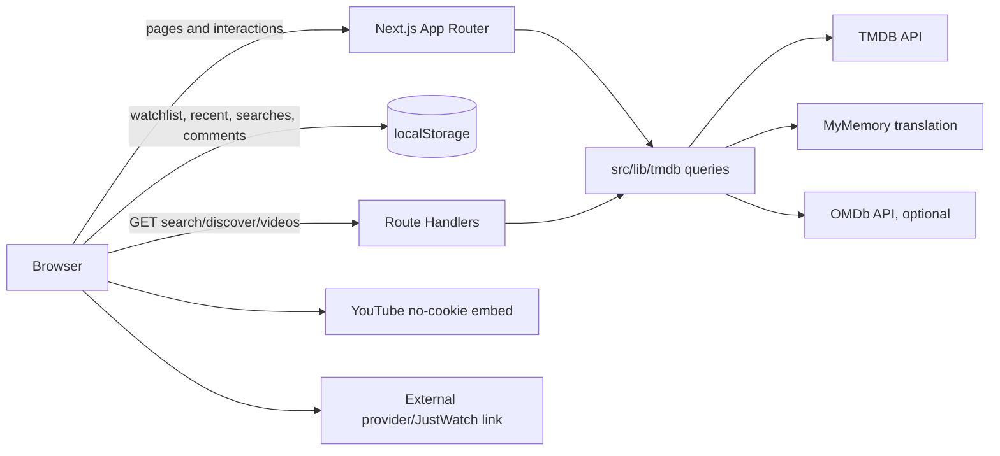
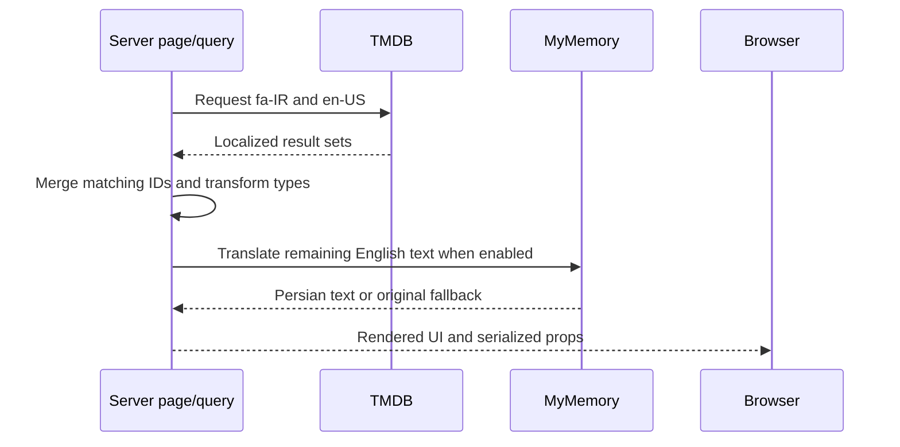

# Architecture

## System overview

Pardeh No is a single Next.js application for Persian movie and TV discovery. The App Router renders initial catalog and detail views on the server. Interactive React Client Components handle search, dialogs, filters, infinite loading, sharing, and browser-local collections. There is no separate application backend, database, authentication service, or background worker.

## Technology stack

| Area | Implementation |
| --- | --- |
| Framework | Next.js `16.3.0-canary.93`, App Router |
| UI runtime | React and React DOM `19.2.8` |
| Language | TypeScript 5, `strict: true`, bundler resolution |
| Styling | Tailwind CSS 4, CSS variables, `tw-animate-css` |
| Components | Radix UI primitives, shadcn `radix-nova`, Lucide icons |
| Font | `@fontsource-variable/vazirmatn` |
| Unit tests | Vitest, Testing Library, jsdom where requested |
| Browser tests | Playwright desktop Chrome and Pixel 7 emulation |
| Package manager | npm with `package-lock.json` |

## Directory boundaries

- `src/app/` owns URLs, metadata, route-level loading/error/not-found states, structured data, and three GET Route Handlers.
- `src/components/` composes product UI. Files with `"use client"` define interactive/browser boundaries.
- `src/components/ui/` contains shared Radix/shadcn-style primitives; product code should reuse these before introducing another primitive.
- `src/lib/tmdb/` is the upstream data boundary: authentication, retries, cache settings, localization, transformations, types, and safe errors.
- `src/lib/storage/media-store.ts` is the browser persistence boundary for watchlist and recently viewed media.
- `tests/fixtures/tmdb-server.mjs` replaces TMDB for deterministic E2E tests.

## Frontend architecture

Pages and layouts are Server Components by default. They fetch data directly through `src/lib/tmdb/queries.ts`, avoiding an internal HTTP hop. Client Components are used where the implementation needs React state/effects, event handlers, navigation transitions, Intersection Observer, Web Share/Clipboard, or `localStorage`.

Important client boundaries include:

- `SiteHeader` and `SearchDialog`
- `HeroBanner`
- browse filters and infinite media grid
- watchlist/recent stores and pages
- comments, trailer dialog, image gallery, and share controls
- Radix dialog, sheet, command, select, and direction primitives

The root layout fixes `lang="fa"` and `dir="rtl"`, wraps the tree with Radix `DirectionProvider`, and supplies global header/footer UI.

## Routes and backend surface

Primary page routes:

- `/`, `/movies`, `/tv`, `/top`, `/search`
- `/genre/[genreId]/[slug]`
- `/movie/[id]/[slug]`, `/tv/[id]/[slug]`
- `/tv/[id]/season/[seasonNumber]`
- `/person/[id]/[slug]`
- `/watchlist`, `/recently-viewed`
- `/about`, `/privacy`, `/terms`, `/copyright`

GET Route Handlers:

- `/api/search?q=...` — first page of multi-search; rejects queries shorter than two characters with an empty result
- `/api/discover?...` — subsequent browse pages; normalizes media type and positive numeric values
- `/api/media/[mediaType]/[id]/videos` — validates media type/numeric ID and returns merged Persian/English videos

Handlers catch typed `TmdbError` values and return safe Persian messages. Search and discovery responses set `Cache-Control: private, no-store`.

## Data flow and localization

`tmdbFetch` accepts either a bearer read token or API key, retries once after HTTP 429/5xx, and maps upstream states to typed errors. Query functions filter incomplete catalog records, merge localized pages/details, translate missing Persian copy, and cap discover pagination at 500 pages.

Cache policy in current code:

- lists: 20 minutes
- details: 6 hours
- genres/configuration: 24 hours
- media videos: 1 hour
- IMDb snapshot resolution: 7 days
- OMDb ratings: 12 hours
- MyMemory translations: 30 days when using the standard Next.js fetch path
- search: `no-store`

When `OUTBOUND_PROXY_URL` is set, TMDB and translation use `undici` with a `ProxyAgent`; that path does not attach Next.js cache metadata.

## Persistence and state

There is no server persistence. The following keys are browser-owned:

- `pardehno:v1:watchlist` — up to 250 media summaries
- `pardehno:v1:recent` — up to 30 media summaries
- `pardehno:v1:searches` — up to 10 strings
- `pardehno:v1:comments:<mediaType>-<id>` — local comments for one title

Watchlist and recent items use `useSyncExternalStore` and listen for cross-tab `storage` events. Comments are seeded from hard-coded samples when no non-empty saved array exists. Clearing browser storage removes personal state; no cross-device sync exists.

## Authentication and authorization

Not implemented. Every visitor is effectively a guest. There are no protected routes, sessions, roles, ownership checks, or server-side user records. Upstream credentials authenticate only the server to external APIs.

## External services

- TMDB: catalog, details, images, credits, videos, genres, external IDs, and watch-provider data
- OMDb: optional IMDb rating/vote enrichment
- MyMemory: optional English-to-Persian server translation
- YouTube: privacy-enhanced iframe embeds for ranked TMDB video records
- JustWatch/provider sites: external availability link supplied within TMDB provider data

## Error handling, logging, and monitoring

Route-level `error.tsx`, `loading.tsx`, and `not-found.tsx` cover application states. Detail routes convert TMDB not-found responses to Next.js 404s; invalid canonical slugs permanently redirect. Client discovery exposes retry UI. Translation, OMDb, sharing, and some trailer failures degrade silently or to empty data.

No structured logger, analytics, error reporting, metrics, tracing, or uptime integration is present. **Needs confirmation:** production observability requirements.

## Security boundaries

- TMDB, OMDb, proxy, and translation-contact values are accessed from server-only modules.
- Only `NEXT_PUBLIC_SITE_URL` is designed for client-visible/build-visible use.
- Search and discover handlers validate or allow-list key inputs before upstream calls; TMDB authentication is attached server-side.
- JSON-LD replaces `<` characters before insertion.
- External links use `rel="noreferrer"`; YouTube uses `youtube-nocookie.com`.
- `localStorage` is untrusted browser data. Media stores perform a minimal shape check, while saved comments are currently cast without full runtime validation.

## Build and deployment

The repository builds and serves with `next build` and `next start`; Node.js 20.9+ is required by the installed Next.js package. Remote images are restricted to `image.tmdb.org`. Image optimization is disabled in fixture mode or when the outbound proxy variable is present.

No Docker files or committed CI/CD workflows exist. `.vercel` is ignored and local project metadata is present outside version control. **Needs confirmation:** the production platform, release process, and environment management policy.

## Architectural limitations

- The home and IMDb Top pages are forced dynamic.
- Local comments include sample content that looks like user discussion but is not shared or server-sourced.
- The “HD” filter means both poster and backdrop paths exist; it does not inspect resolution.
- Filtering after TMDB returns a page can make displayed counts differ from the visible filtered items.
- Search parses a page parameter but exposes no pagination UI.
- Proxy-mode upstream calls bypass the documented Next.js revalidation options because they use `undici`.
- There is no rate limiting at the application Route Handler boundary.
